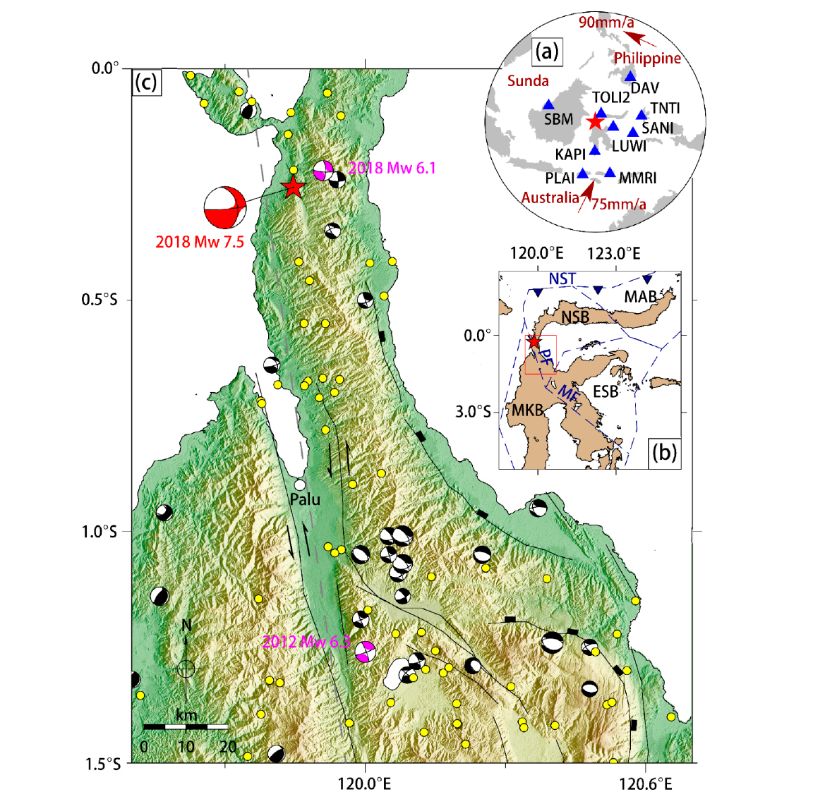

```{r setting, echo=FALSE, warning=FALSE,message=FALSE,collapse=TRUE}
# Setting
rm(list = ls(all.names = T))
cat('\14')
require(data.table)
require(stringr)
require(raster)
require(rasterVis)
require(RColorBrewer)
require(rgdal)
require(leaflet)
require(knitr)
require(dplyr)
require(kableExtra)
require(DT)

```


# Objective

The following report contains the description of the impact, damages, and losses due the M7.5 earthquake that occurred at Palu, Indonesia on 28 Sept’18. It also includes description of the process of footprint generation using OpenQuake engine by GEM foundation. A reference footprint
for the same can be found in [https://www.usgs.gov/news/magnitude-75-earthquake-near-palu-indonesia](https://www.usgs.gov/news/magnitude-75-earthquake-near-palu-indonesia).


## Brief technical summary

### Event description

On 28 September 2018, at 10:02:45 (UTC), an $M_W$ 7.5 earthquake hit central Sulawesi, Indonesia. The epicenter (0.256S, 119.846E), determined by the United States Geological Survey (USGS), was located about 77 km north of Palu City (Figure 1). This seismic event triggered catastrophic soil liquefaction, landslides, and a tsunami as well.  Both the USGS and the gCMT (global CMT: https//:www.globalcmt.org) provided the focal mechanism solutions, which indicated that the earthquake occurred on the north section of the Palu-Koro Fault, a predominantly sinistral fault with a normal component [1].

The September 2018 earthquake likely occurred due to slip on the fast slipping, predominantly strike-slip, NNW trending, Palu-Koro fault at the western boundary of the North Sula block (Figure 1), which forms part of the complex triple junction at the intersection of the Australian, Philippine, and Sunda plates (Figure 1). The fault accommodates up to 40 mm/year of left-lateral motion (with some normal component) due to block rotation. The strain accumulates over many decades or centuries and is released suddenly over a few seconds as the fault slips during the earthquake, causing the ground to shake[6].

#### __Figure 1__  Tectonic setting of the 2018 Mw 7.5 Palu earthquake [5]




### Impact

This event affects central of Sulawesi and very high impact on Palu city, Donggala, Sigi and Parigi Moutong. At least 2,077 people killed, 4,438 injured, 1,075 missing and 206,524 displaced; at least 68,451 houses damaged or destroyed; bridges and roads damaged; power and telecommunication outages occurred in Sulawesi Tengah from the combined effects of the earthquake, tsunami, liquefaction and landslides. The towns of Balaroa and Petobo were submerged due to liquefaction. A tsunami with an estimated wave height of 7 m was observed at Palu. Damage estimated at 911 million US dollars[2].


### Structural Damages

Among the damaged structures, most affected were either __Non-Engineered Light Timber Construction Frame__ or __Non-Engineered Lightly Reinforced Concrete Construction Frame__. Most of the Light Timber Frame buildings simply washed away in the face of the following Tsunami. Non-Engineered Lightly Reinforced Concrete Construction Frame buildings, most of which might not have been as per the accepted codal provisions, also suffered severe to complete damage[3]. __Engineered Reinforced Concrete Construction Frame__ buildings constituted a smaller portion of all structures (4%). In this, the tsunami affected the ground and first floors. Most damage was observed on first floor levels included failure of infill clay brick masonry partitioning between reinforced concrete columns, external doors and windows and electricity and plumbing services. 


In Palu City, non-engineered __light timber__ and __lightly reinforced concrete__ construction frame buildings were highly susceptible to non-structural component damage when the tsunami flow depths respectively exceed 0.4 m and 1 m above the first finished floor level. Irreparable or complete damage of construction frame components occurred regularly when flow depths exceeded 1.2 m above first finished floor level. Engineered __reinforced concrete__ construction frame buildings were more resistant, with only non-structural component damage observed for flow depths up to 2.5 m above first finished floor level [3]. 


Additionally, damage observed to seawalls at Port of Donggala was predominantly caused by the earthquake and subsidence, while tsunami damage to seawall superstructures was observed at Port of Pantaloan[3].


## GMPE model

At present, Indonesia is yet to develop a ground motion prediction equation (GMPE) based on local strong motion data, although recently, there have been initiatives in deriving a GMPE using the new strong motion accelerometer network deployed by the Indonesian Meteorology, Climatology and Geophysics Agency (BMKG).


Stewart et al.[4] described the selection criteria for deciding on the appropriate GMPE as:

_“1. More emphasis given to GMPEs derived from international than from local data sets. Exceptions can be made when a GMPE derived from a local data set has been checked internationally and found to perform well._

_2. More emphasis given to GMPEs that have attributes of their functional form that we consider desirable, including saturation with magnitude, magnitude-dependent distance scaling and terms that mimic the effects anelastic attenuation._

_3. If there are multiple GMPEs that are well constrained by data but exhibit different trends, it is desirable to capture those trends in the selected GMPEs to properly represent epistemic uncertainty.”_

This study uses Chiou and Youngs, 2008 (CY08)[10] model as GMPE. CY08 was developed as part of the Pacific Earthquake Engineering Research Center’s (PEER) Next Generation Attenuation model (NGA) project using PEER-NGA empirical strong motion database that contains 3,551 recordings from 173 earthquakes. This ground motion model was developed to represent free-field motions from shallow crustal earthquakes in active tectonic regions and hence is an appropriate match for the Palu fault mechanism. The data set is also global in nature.


## Event Footprint generation

The event footprint was generated using Openquake Software by Global Earthquake Model (GEM). As the current event is already specified, the calculation was done in “scenario” mode for a 2 km grid. A total of 1000 realizations (for aleatoric uncertainty) are generated and the mean footprint is considered.


For the simulation, rupture model was specified as an area source with details from [USGS site](https://earthquake.usgs.gov/archive/product/shakemap/us1000h3p4/us/1543306574233/download/palu_fault.txt). The fault was modeled as a line source with three distinct segments [8]. The site parameters such as shear wave Time-averaged shear-wave velocity over the top 30 meters of the subsurface (V~S30~) was obtained from USGS[9]. However, the parameter Z~1.0~ (depth to V~S30~ = 1.0 km/s) was calculated by the relationship proposed by Kaklamanos et al[11] as given below.

$$ln(Z_{1.0})=28.5-\frac{3.82}{8}ln(V^8_{S30}+378.7^8)$$

The site data was specified in a separate file. For comparison PGA, Sa(0.3) and Sa(1.0) are evaluated. For limitations in computational resources, no spatial correlation algorithm is applied.

### Using OpenQuake Engine

The inputfiles are present in the sub-folder [OQ_input](https://github.com/soumyadipta1234/Palu_Earthquake_OpenQuake_Example/tree/master/OQ_input). [job.ini](https://github.com/soumyadipta1234/Palu_Earthquake_OpenQuake_Example/blob/master/OQ_input/job.ini) is the main input file that referes to rapture model and site model specified by [rupture_model.xml](https://github.com/soumyadipta1234/Palu_Earthquake_OpenQuake_Example/blob/master/OQ_input/rupture_model.xml) and [site_data.csv](https://github.com/soumyadipta1234/Palu_Earthquake_OpenQuake_Example/blob/master/OQ_input/site_data.csv) respectively. The grid points where the intensity parameters are needed is listed in the file [site_loc.csv](https://github.com/soumyadipta1234/Palu_Earthquake_OpenQuake_Example/blob/master/OQ_input/site_loc.csv). The export directory can be changed as needed to [job.ini](https://github.com/soumyadipta1234/Palu_Earthquake_OpenQuake_Example/blob/master/OQ_input/job.ini). The input directory [OQ_input](https://github.com/soumyadipta1234/Palu_Earthquake_OpenQuake_Example/tree/master/OQ_input) that contains all of the above mentioned files is to be zipped in [.zip](https://github.com/soumyadipta1234/Palu_Earthquake_OpenQuake_Example/blob/master/OQ_input.zip) format and used as a input to Openquake engine.

### Post-processing with R

The subsequent R code used for the post-processing of the data is in [Palu_earthquake.rmd](https://github.com/soumyadipta1234/Palu_Earthquake_OpenQuake_Example/blob/master/Palu_earthquake.rmd) file. The list of R libraries used for this task is given below.

+ data.table
+ stringr
+ raster
+ rasterVis
+ RColorBrewer
+ rgdal
+ leaflet
+ knitr
+ dplyr
+ kableExtra
+ DT


Please note that the OpenQuake output data is not listed in this repository due to its size.

## Comparison with USGS data

The postprocessing of the generated data was done in R and the current reporting utilizes the Rmarkdown tool. The obtained footprints (PGA, SA(0.3) and SA(1.0)) were converted to raster and plotted below. For comparison, USGS shake maps are also converted to raster and plotted along with. For a finer comparison, the contour maps are created for both computed and USGS footprints and plotted below.

It can be observed that the footprints from computation and USGS match closely. The Contour maps too overlay on each other for the most part. However, if we zoom in, it is visible that there is a spike of all there parameters near Palu. This was not fully captured in the computed footprint. Note that the following assumptions may have played a role in the discrepancies.

1. The V~S30~ values used were from crud grid of data and may not be accurate enough.
2. Z~1.0~ were calculated using empirical relations.
3. No effect of the topography of the region were taken into consideration.


```{r Shakemap, echo=FALSE, warning=FALSE,message=FALSE,collapse=TRUE,fig.height=6, fig.width=9}

# load files
Intensity = fread("D:\\Palu_Earthquake_Simulation\\Seismic_Hazard\\All_outputs\\output-103-gmf_data-csv\\gmf-data_66.csv")
Locations = fread("D:\\Palu_Earthquake_Simulation\\Seismic_Hazard\\All_outputs\\output-103-gmf_data-csv\\sitemesh_66.csv")
# Attaching the lat-long to each event
Int_Loc = merge(Intensity,Locations,by.y="site_id",by.x="sid")
# Taking mean
Int_Loc = Int_Loc[,.(PGA_mean = mean(gmv_PGA),Sa0.3 = mean(`gmv_SA(0.3)`),Sa1 = mean(`gmv_SA(1.0)`)),by=sid]
Int_Loc = merge(Int_Loc,Locations,by.y="site_id",by.x="sid")
fwrite(Int_Loc,"D:\\Palu_Earthquake_Simulation\\Seismic_Hazard\\All_outputs\\output-103-gmf_data-csv\\Int_Loc.csv")

# Setup for raster
lat_max = max(Int_Loc$lat)
lat_min = min(Int_Loc$lat)
lon_max = max(Int_Loc$lon)
lon_min = min(Int_Loc$lon)
cell_size = 0.025
ncols = ((lon_max - lon_min)/cell_size)+1
nrows = ((lat_max - lat_min)/cell_size)+1
gridtemp = raster(nrows=nrows, ncols=ncols, xmn=lon_min, xmx=lon_max, ymn=lat_min, ymx=lat_max, res=cell_size, crs="+proj=longlat +datum=WGS84")
# Raster template
temp_coords = cbind(Int_Loc$lon, Int_Loc$lat)

# Processing PGA
PGA = rasterize(temp_coords, gridtemp,Int_Loc$PGA_mean)
writeRaster(PGA,"D:\\Palu_Earthquake_Simulation\\Seismic_Hazard\\All_outputs\\output-103-gmf_data-csv\\PGA.asc","ascii",overwrite=TRUE)
# Contour
PGA_Contour=rasterToContour(PGA)
# Write PGA_Contour
shapefile(PGA_Contour,"D:\\Palu_Earthquake_Simulation\\Seismic_Hazard\\All_outputs\\output-103-gmf_data-csv\\PGA_Contour.shp",overwrite=TRUE)
# Read the shapefile
PGA_Contour = readOGR("D:\\Palu_Earthquake_Simulation\\Seismic_Hazard\\All_outputs\\output-103-gmf_data-csv\\PGA_Contour.shp",
                  GDAL1_integer64_policy = TRUE,verbose = FALSE)

# Color pal
PGA_pal = colorNumeric("YlOrRd", values(PGA),
  na.color = "transparent")

# Processing SA(0.3)
SA0.3 = rasterize(temp_coords, gridtemp,Int_Loc$Sa0.3)
writeRaster(SA0.3,"D:\\Palu_Earthquake_Simulation\\Seismic_Hazard\\All_outputs\\output-103-gmf_data-csv\\SA0_3.asc","ascii",overwrite=TRUE)
# Contour
SA0.3_Contour=rasterToContour(SA0.3)
# Write PGA_Contour
shapefile(SA0.3_Contour,"D:\\Palu_Earthquake_Simulation\\Seismic_Hazard\\All_outputs\\output-103-gmf_data-csv\\SA0_3_Contour.shp",overwrite=TRUE)
# Read the shapefile
SA0.3_Contour <- readOGR("D:\\Palu_Earthquake_Simulation\\Seismic_Hazard\\All_outputs\\output-103-gmf_data-csv\\SA0_3_Contour.shp",
                  GDAL1_integer64_policy = TRUE,verbose = FALSE)
# Color pal
SA0.3_pal = colorNumeric("YlOrRd", values(SA0.3),
  na.color = "transparent")

# Processing SA(1.0)
SA1 = rasterize(temp_coords, gridtemp,Int_Loc$Sa1)
writeRaster(SA1,"D:\\Palu_Earthquake_Simulation\\Seismic_Hazard\\All_outputs\\output-103-gmf_data-csv\\SA1.asc","ascii",overwrite=TRUE)
#Contour
SA1_Contour=rasterToContour(SA1)
# Write PGA_Contour
shapefile(SA1_Contour,"D:\\Palu_Earthquake_Simulation\\Seismic_Hazard\\All_outputs\\output-103-gmf_data-csv\\SA1_Contour.shp",overwrite=TRUE)
# Read the shapefile
SA1_Contour <- readOGR("D:\\Palu_Earthquake_Simulation\\Seismic_Hazard\\All_outputs\\output-103-gmf_data-csv\\SA1_Contour.shp",
                  GDAL1_integer64_policy = TRUE,verbose = FALSE)
# Color pal
SA1_pal = colorNumeric("YlOrRd", values(SA1),
  na.color = "transparent")

# Calculations with USGS data
USGS_grid = fread("D:\\Palu_Earthquake_Simulation\\Resources\\grid.csv")
USGS_grid = USGS_grid[lat<=lat_max & lat>=lat_min & lon <=lon_max & lon>=lon_min]
# fwrite(USGS_grid,"D:\\Palu_Earthquake_Simulation\\Resources\\minigrid.csv")
USGS_grid = USGS_grid[,c("lat","lon","pga","psa03","psa10")]
USGS_grid = USGS_grid[,':='(pga=pga/100,psa03=psa03/100,psa10=psa10/100)]

# Setup for raster
lat_max = max(USGS_grid$lat)
lat_min = min(USGS_grid$lat)
lon_max = max(USGS_grid$lon)
lon_min = min(USGS_grid$lon)
cell_size = 0.0167
ncols = round((lon_max - lon_min)/cell_size)+1
nrows = round((lat_max - lat_min)/cell_size)+1
gridtemp = raster(nrows=nrows, ncols=ncols, xmn=lon_min, xmx=lon_max, ymn=lat_min, ymx=lat_max, res=cell_size, crs="+proj=longlat +datum=WGS84")
# Raster template
temp_coords = cbind(USGS_grid$lon, USGS_grid$lat)

# Processing PGA from USGS
PGA_USGS = rasterize(temp_coords, gridtemp,USGS_grid$pga)
writeRaster(PGA_USGS,"D:\\Palu_Earthquake_Simulation\\Resources\\PGA_USGS.asc","ascii",overwrite=TRUE)
# Color pal
PGA_pal_USGS = colorNumeric("YlOrRd", values(PGA_USGS),
  na.color = "transparent")

# Processing SA(0.3) from USGS
SA0.3_USGS = rasterize(temp_coords, gridtemp,USGS_grid$psa03)
writeRaster(SA0.3_USGS,"D:\\Palu_Earthquake_Simulation\\Resources\\SA0.3_USGS.asc","ascii",overwrite=TRUE)
# Color pal
SA0.3_pal_USGS = colorNumeric("YlOrRd", values(SA0.3_USGS),
  na.color = "transparent")

# Processing SA(1.0) from USGS
SA1_USGS = rasterize(temp_coords, gridtemp,USGS_grid$psa10)
writeRaster(SA1_USGS,"D:\\Palu_Earthquake_Simulation\\Resources\\SA1_USGS.asc","ascii",overwrite=TRUE)
# Color pal
SA1_pal_USGS = colorNumeric("YlOrRd", values(SA1_USGS),
  na.color = "transparent")


# Contour
PGA_Contour_USGS=rasterToContour(PGA_USGS)
SA03_Contour_USGS=rasterToContour(SA0.3_USGS)
SA1_Contour_USGS=rasterToContour(SA1_USGS)

# # Read the USGA PGA contour shapefile
# PGA_Contour_USGS = readOGR("D:\\Palu_Earthquake_Simulation\\Resources\\shape\\pga.shp",
#                   GDAL1_integer64_policy = TRUE,verbose = FALSE)
# SA0.3_Contour_USGS = readOGR("D:\\Palu_Earthquake_Simulation\\Resources\\shape\\psa03.shp",
#                   GDAL1_integer64_policy = TRUE,verbose = FALSE)
# SA1_Contour_USGS = readOGR("D:\\Palu_Earthquake_Simulation\\Resources\\shape\\psa10.shp",
#                   GDAL1_integer64_policy = TRUE,verbose = FALSE)


# leaflet plot
L = leaflet()%>%
  setView(lng = 119.89,lat = -0.674,zoom = 8)%>%
  addTiles(urlTemplate = 'http://{s}.tile.openstreetmap.org/{z}/{x}/{y}.png',group = "Map")%>%
  addMarkers(lng = 119.846,lat = -0.256,group = "Epicentre")%>%
  # Adding raster images
  addRasterImage(PGA, colors = PGA_pal, opacity = 0.6,group = "PGA_Computed") %>%
  addRasterImage(SA0.3, colors = SA0.3_pal, opacity = 0.6,group = "Sa03_Computed") %>%
  addRasterImage(SA1, colors = SA1_pal, opacity = 0.6,group = "Sa1_Computed") %>%
  addRasterImage(PGA_USGS, colors = PGA_pal_USGS, opacity = 0.6,group = "PGA_USGS")%>%
  addRasterImage(SA0.3_USGS, colors = SA0.3_pal_USGS, opacity = 0.6,group = "Sa03_USGS") %>%
  addRasterImage(SA1_USGS, colors = SA1_pal_USGS, opacity = 0.6,group = "Sa1_USGS") %>%
  
  # Adding PGA contour (Computed)
    addPolylines(data = PGA_Contour,color = "#444444", weight = 1, smoothFactor = 0.1,
      opacity = 1.0, fillOpacity = 0.5,
      highlightOptions = highlightOptions(color = "white", weight = 2,
        bringToFront = TRUE),
      label = ~level,
    labelOptions = labelOptions(noHide = T),group = "PGA_Contour_Computed")%>%

  # Adding SA0.3 contour (Computed)
    addPolylines(data = SA0.3_Contour,color = "#444444", weight = 1, smoothFactor = 0.1,
      opacity = 1.0, fillOpacity = 0.5,
      highlightOptions = highlightOptions(color = "white", weight = 2,
        bringToFront = TRUE),
      label = ~level,
    labelOptions = labelOptions(noHide = T),group = "Sa03_Contour_Computed")%>%

  # Adding SA1.0 contours (Computed)
    addPolylines(data = SA1_Contour,color = "#444444", weight = 1, smoothFactor = 0.1,
      opacity = 1.0, fillOpacity = 0.5,
      highlightOptions = highlightOptions(color = "white", weight = 2,
        bringToFront = TRUE),
      label = ~level,
    labelOptions = labelOptions(noHide = T),group = "Sa1_Contours_Computed")%>%
  # Adding PGA contour (USGS)
    addPolylines(data = PGA_Contour_USGS,color = "#38179b", weight = 1, smoothFactor = 0.1,
      opacity = 1.0, fillOpacity = 0.5,
      highlightOptions = highlightOptions(color = "white", weight = 2,
        bringToFront = TRUE),
      label = ~level,
    labelOptions = labelOptions(noHide = T),group = "PGA_Contour_USGS")%>%

  # Adding SA0.3 contour (USGS)
    addPolylines(data = SA03_Contour_USGS,color = "#812913", weight = 1, smoothFactor = 0.1,
      opacity = 1.0, fillOpacity = 0.5,
      highlightOptions = highlightOptions(color = "white", weight = 2,
        bringToFront = TRUE),
      label = ~level,
    labelOptions = labelOptions(noHide = T),group = "Sa03_Contour_USGS")%>%

  # Adding SA1.0 contour (USGS)
    addPolylines(data = SA1_Contour_USGS,color = "#0d5914", weight = 1, smoothFactor = 0.1,
      opacity = 1.0, fillOpacity = 0.5,
      highlightOptions = highlightOptions(color = "white", weight = 2,
        bringToFront = TRUE),
      label = ~level,
    labelOptions = labelOptions(noHide = T),group = "Sa1_Contour_USGS")%>%
  
  
  # Adding legends and options
  addLegend(pal = PGA_pal, values = values(PGA),title = "PGA (g) Computed",,group = "PGA_Computed",position = "bottomright")%>%
  addLegend(pal = SA0.3_pal, values = values(SA0.3),title = "Sa(0.3) (g) Computed",group = "Sa03_Computed",position = "topleft")%>%
  addLegend(pal = SA1_pal, values = values(SA1),title = "Sa(1.0) (g) Computed",group = "Sa1_Computed",position = "bottomleft")%>%

  addLegend(pal = PGA_pal_USGS, values = values(PGA_USGS),title = "PGA (g) USGS",group = "PGA_USGS",position = "bottomleft")%>%
  addLegend(pal = SA0.3_pal_USGS, values = values(SA0.3_USGS),title = "Sa(0.3) (g) USGS",group = "Sa03_USGS",position = "bottomleft")%>%
  addLegend(pal = SA1_pal_USGS, values = values(SA1_USGS),title = "Sa(1.0) (g) USGS",group = "Sa1_USGS",position = "bottomleft")%>%
  
  
  addLayersControl( baseGroups = c("Map"),
  overlayGroups = c(
                    "Epicentre",
                    "PGA_Computed",
                    "Sa03_Computed",
                    "Sa1_Computed",
                    "PGA_USGS",
                    "Sa03_USGS",
                    "Sa1_USGS",
                    "PGA_Contour_Computed",
                    "Sa03_Contour_Computed",
                    "Sa1_Contours_Computed",
                    "PGA_Contour_USGS",
                    "Sa03_Contour_USGS",
                    "Sa1_Contour_USGS"
                    ),
  options = layersControlOptions(collapsed = TRUE))%>%
#  hideGroup("PGA_Computed")%>%
  hideGroup("Sa03_Computed")%>%
  hideGroup("Sa1_Computed")%>%
  hideGroup("PGA_USGS")%>%
  hideGroup("Sa03_USGS")%>%
  hideGroup("Sa1_USGS")%>%
  hideGroup("PGA_Contour_Computed")%>%
  hideGroup("Sa03_Contour_Computed")%>%
  hideGroup("Sa1_Contours_Computed")%>%
  hideGroup("PGA_Contour_USGS")%>%
  hideGroup("Sa03_Contour_USGS")%>%
  hideGroup("Sa1_Contour_USGS")
L

```

## Reference:
1. Wang, Y., Feng, W., Chen, K. and Samsonov, S., 2019. Source Characteristics of the 28 September 2018 Mw 7.4 Palu, Indonesia, Earthquake Derived from the Advanced Land Observation Satellite 2 Data. Remote Sensing, 11(17), p.1999.

2. [https://earthquake.usgs.gov/earthquakes/eventpage/us1000h3p4/origin/detail](https://earthquake.usgs.gov/earthquakes/eventpage/us1000h3p4/origin/detail)

3. Paulik, R., Gusman, A., Williams, J.H., Pratama, G.M., Lin, S.L., Prawirabhakti, A., Sulendra, K., Zachari, M.Y., Fortuna, Z.E.D., Layuk, N.B.P. and Suwarni, N.W.I., 2019. Tsunami hazard and built environment damage observations from palu city after the september 28 2018 sulawesi earthquake and tsunami. Pure and Applied Geophysics, 176(8), pp.3305-3321.

4. Stewart, J.P., Douglas, J., Javanbarg, M., Bozorgnia, Y., Abrahamson, N.A., Boore, D.M., Campbell, K.W., Delavaud, E., Erdik, M. and Stafford, P.J., 2015. Selection of ground motion prediction equations for the global earthquake model. Earthquake Spectra, 31(1), pp.19-45.

5. Fang, J., Xu, C., Wen, Y., Wang, S., Xu, G., Zhao, Y. and Yi, L., 2019. The 2018 Mw 7.5 Palu Earthquake: A Supershear Rupture Event Constrained by InSAR and Broadband Regional Seismograms. Remote Sensing, 11(11), p.1330.

6. [https://www.air-worldwide.com/Blog/How-the-Palu-Earthquake-Caused-So-Much-Devastation/](https://www.air-worldwide.com/Blog/How-the-Palu-Earthquake-Caused-So-Much-Devastation/)

7. [https://earthquake.usgs.gov/archive/product/shakemap/us1000h3p4/us/1543306574233/download/palu_fault.txt](https://www.air-worldwide.com/Blog/How-the-Palu-Earthquake-Caused-So-Much-Devastation/)

8. Ulrich, T., Vater, S., Madden, E.H., Behrens, J., van Dinther, Y., van Zelst, I., Fielding, E.J., Liang, C. and Gabriel, A.A., 2019. Coupled, Physics-based Modeling Reveals Earthquake Displacements are Critical to the 2018 Palu, Sulawesi Tsunami.

9. https://earthquake.usgs.gov/static/lfs/data/

10. Chiou, B.J. and Youngs, R.R., 2008. An NGA model for the average horizontal component of peak ground motion and response spectra. Earthquake Spectra, 24(1), pp.173-215.

11. Kaklamanos, J., Baise, L.G. and Boore, D.M., 2011. Estimating unknown input parameters when implementing the NGA ground-motion prediction equations in engineering practice. Earthquake Spectra, 27(4), pp.1219-1235.
