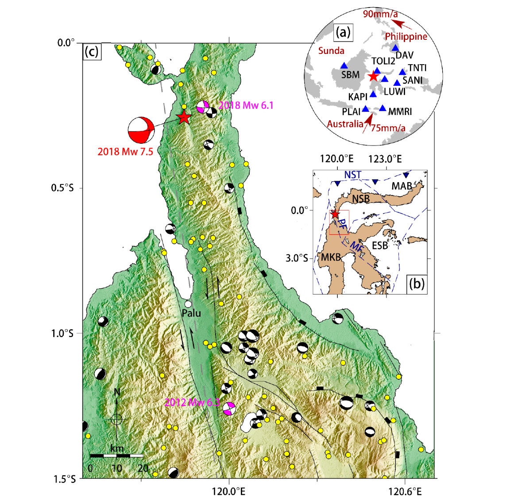

Palu Earthquake Footprint Generation
================

  - [Objective](#objective)
      - [Brief technical summary](#brief-technical-summary)
          - [Event description](#event-description)
          - [Impact](#impact)
          - [Structural Damages](#structural-damages)
      - [GMPE model](#gmpe-model)
      - [Event Footprint generation](#event-footprint-generation)
      - [OpenQuake output report](#OpenQuake-output-report)
      - [Reference:](#reference)



# Objective

The following report contains the description of the impact, damages,
and losses due the M7.5 earthquake that occurred at Palu, Indonesia on 28
Sept’18. It also includes description of the process of footprint
generation using OpenQuake engine by GEM foundation. Please download the
file [Palu_earthquake.html](https://github.com/samsark1996/palu_earthquake_footprint/blob/main/Palu_earthquake.html)
and open it in your web browser for proper rendering of the footprints.

A reference footprint for the same can be found in
<https://www.usgs.gov/news/magnitude-75-earthquake-near-palu-indonesia>.

## Brief technical summary

### Event description

On 28 September 2018, at 10:02:45 (UTC), an \(M_W\) 7.5 earthquake hit
central Sulawesi, Indonesia. The epicenter (0.256S, 119.846E),
determined by the United States Geological Survey (USGS), was located
about 77 km north of Palu City (Figure 1). This seismic event triggered
catastrophic soil liquefaction, landslides, and a tsunami as well. Both
the USGS and the gCMT (global CMT: https//:www.globalcmt.org) provided
the focal mechanism solutions, which indicated that the earthquake
occurred on the north section of the Palu-Koro Fault, a predominantly
sinistral fault with a normal component \[1\].

The September 2018 earthquake likely occurred due to slip on the fast
slipping, predominantly strike-slip, NNW trending, Palu-Koro fault at
the western boundary of the North Sula block (Figure 1), which forms
part of the complex triple junction at the intersection of the
Australian, Philippine, and Sunda plates (Figure 1). The fault
accommodates up to 40 mm/year of left-lateral motion (with some normal
component) due to block rotation. The strain accumulates over many
decades or centuries and is released suddenly over a few seconds as the
fault slips during the earthquake, causing the ground to shake\[6\].

#### **Figure 1** Tectonic setting of the 2018 Mw 7.5 Palu earthquake \[5\]



### Impact

This event affects central of Sulawesi and very high impact on Palu
city, Donggala, Sigi and Parigi Moutong. At least 2,077 people killed,
4,438 injured, 1,075 missing and 206,524 displaced; at least 68,451
houses damaged or destroyed; bridges and roads damaged; power and
telecommunication outages occurred in Sulawesi Tengah from the combined
effects of the earthquake, tsunami, liquefaction and landslides. The
towns of Balaroa and Petobo were submerged due to liquefaction. A
tsunami with an estimated wave height of 7 m was observed at Palu.
Damage estimated at 911 million US dollars\[2\].

### Structural Damages

Among the damaged structures, most affected were either **Non-Engineered
Light Timber Construction Frame** or **Non-Engineered Lightly Reinforced
Concrete Construction Frame**. Most of the Light Timber Frame buildings
simply washed away in the face of the following Tsunami. Non-Engineered
Lightly Reinforced Concrete Construction Frame buildings, most of which
might not have been as per the accepted codal provisions, also suffered
severe to complete damage\[3\]. **Engineered Reinforced Concrete
Construction Frame** buildings constituted a smaller portion of all
structures (4%). In this, the tsunami affected the ground and first
floors. Most damage was observed on first floor levels included failure
of infill clay brick masonry partitioning between reinforced concrete
columns, external doors and windows and electricity and plumbing
services.

In Palu City, non-engineered **light timber** and **lightly reinforced
concrete** construction frame buildings were highly susceptible to
non-structural component damage when the tsunami flow depths
respectively exceed 0.4 m and 1 m above the first finished floor level.
Irreparable or complete damage of construction frame components occurred
regularly when flow depths exceeded 1.2 m above first finished floor
level. Engineered **reinforced concrete** construction frame buildings
were more resistant, with only non-structural component damage observed
for flow depths up to 2.5 m above first finished floor level \[3\].

Additionally, damage observed to seawalls at Port of Donggala was
predominantly caused by the earthquake and subsidence, while tsunami
damage to seawall superstructures was observed at Port of
Pantaloan\[3\].

## GMPE model

This study uses Chiou and Youngs, 2008 (CY08)\[10\] model as GMPE. CY08
was developed as part of the Pacific Earthquake Engineering Research
Center’s (PEER) Next Generation Attenuation model (NGA) project using
PEER-NGA empirical strong motion database that contains 3,551 recordings
from 173 earthquakes. This ground motion model was developed to
represent free-field motions from shallow crustal earthquakes in active
tectonic regions and hence is an appropriate match for the Palu fault
mechanism. The data set is also global in nature.

## Event Footprint generation

The event footprint was generated using Openquake Software by Global
Earthquake Model (GEM). As the current event is already specified, the
calculation was done in “scenario” mode for a 2 km grid. A total of 1000
realizations (for aleatoric uncertainty) are generated and the mean
footprint is considered.

For a more detailed report with the plot of generated footprint, please
check the Palu_earthquake.html file.

## OpenQuake output report

```
Hazard estimation 2km grid Area Source
==========================================

============== ===================
checksum32     3,546,521,487      
date           2020-01-04T15:31:57
engine_version 3.7.1              
============== ===================

num_sites = 27578, num_levels = 3, num_rlzs = 1

Parameters
----------
=============================== ==================
calculation_mode                'scenario'        
number_of_logic_tree_samples    0                 
maximum_distance                {'default': 200.0}
investigation_time              None              
ses_per_logic_tree_path         1                 
truncation_level                3.0               
rupture_mesh_spacing            2.0               
complex_fault_mesh_spacing      2.0               
width_of_mfd_bin                None              
area_source_discretization      None              
ground_motion_correlation_model None              
minimum_intensity               {}                
random_seed                     2997              
master_seed                     0                 
ses_seed                        42                
=============================== ==================

Input files
-----------
============= ========================================
Name          File                                    
============= ========================================
job_ini       `job.ini <job.ini>`_                    
rupture_model `rupture_model.xml <rupture_model.xml>`_
site_model    `site_data.csv <site_data.csv>`_        
============= ========================================

Composite source model
----------------------
========= ======= =============== ================
smlt_path weight  gsim_logic_tree num_realizations
========= ======= =============== ================
b_1       1.00000 trivial(1)      1               
========= ======= =============== ================

Realizations per (GRP, GSIM)
----------------------------

::

  <RlzsAssoc(size=1, rlzs=1)>

Number of ruptures per tectonic region type
-------------------------------------------
============ ====== === ============ ============
source_model grp_id trt eff_ruptures tot_ruptures
============ ====== === ============ ============
scenario     0      *   1            0           
============ ====== === ============ ============

Information about the tasks
---------------------------
Not available

Data transfer
-------------
==== ==== ========
task sent received
==== ==== ========

Slowest operations
------------------
====================== ======== ========= ======
calc_66                time_sec memory_mb counts
====================== ======== ========= ======
ScenarioCalculator.run 116      0.0       1     
saving gmfs            104      0.0       1     
computing gmfs         10       315       1     
====================== ======== ========= ======

```

## Reference:
1. Wang, Y., Feng, W., Chen, K. and Samsonov, S., 2019. Source Characteristics of the 28 September 2018 Mw 7.4 Palu, Indonesia, Earthquake Derived from the Advanced Land Observation Satellite 2 Data. Remote Sensing, 11(17), p.1999.

2. [https://earthquake.usgs.gov/earthquakes/eventpage/us1000h3p4/origin/detail](https://earthquake.usgs.gov/earthquakes/eventpage/us1000h3p4/origin/detail)

3. Paulik, R., Gusman, A., Williams, J.H., Pratama, G.M., Lin, S.L., Prawirabhakti, A., Sulendra, K., Zachari, M.Y., Fortuna, Z.E.D., Layuk, N.B.P. and Suwarni, N.W.I., 2019. Tsunami hazard and built environment damage observations from palu city after the september 28 2018 sulawesi earthquake and tsunami. Pure and Applied Geophysics, 176(8), pp.3305-3321.

4. Stewart, J.P., Douglas, J., Javanbarg, M., Bozorgnia, Y., Abrahamson, N.A., Boore, D.M., Campbell, K.W., Delavaud, E., Erdik, M. and Stafford, P.J., 2015. Selection of ground motion prediction equations for the global earthquake model. Earthquake Spectra, 31(1), pp.19-45.

5. Fang, J., Xu, C., Wen, Y., Wang, S., Xu, G., Zhao, Y. and Yi, L., 2019. The 2018 Mw 7.5 Palu Earthquake: A Supershear Rupture Event Constrained by InSAR and Broadband Regional Seismograms. Remote Sensing, 11(11), p.1330.

6. [https://www.air-worldwide.com/Blog/How-the-Palu-Earthquake-Caused-So-Much-Devastation/](https://www.air-worldwide.com/Blog/How-the-Palu-Earthquake-Caused-So-Much-Devastation/)

7. [https://earthquake.usgs.gov/archive/product/shakemap/us1000h3p4/us/1543306574233/download/palu_fault.txt](https://www.air-worldwide.com/Blog/How-the-Palu-Earthquake-Caused-So-Much-Devastation/)

8. Ulrich, T., Vater, S., Madden, E.H., Behrens, J., van Dinther, Y., van Zelst, I., Fielding, E.J., Liang, C. and Gabriel, A.A., 2019. Coupled, Physics-based Modeling Reveals Earthquake Displacements are Critical to the 2018 Palu, Sulawesi Tsunami.

9. https://earthquake.usgs.gov/static/lfs/data/

10. Chiou, B.J. and Youngs, R.R., 2008. An NGA model for the average horizontal component of peak ground motion and response spectra. Earthquake Spectra, 24(1), pp.173-215.

11. Kaklamanos, J., Baise, L.G. and Boore, D.M., 2011. Estimating unknown input parameters when implementing the NGA ground-motion prediction equations in engineering practice. Earthquake Spectra, 27(4), pp.1219-1235.
